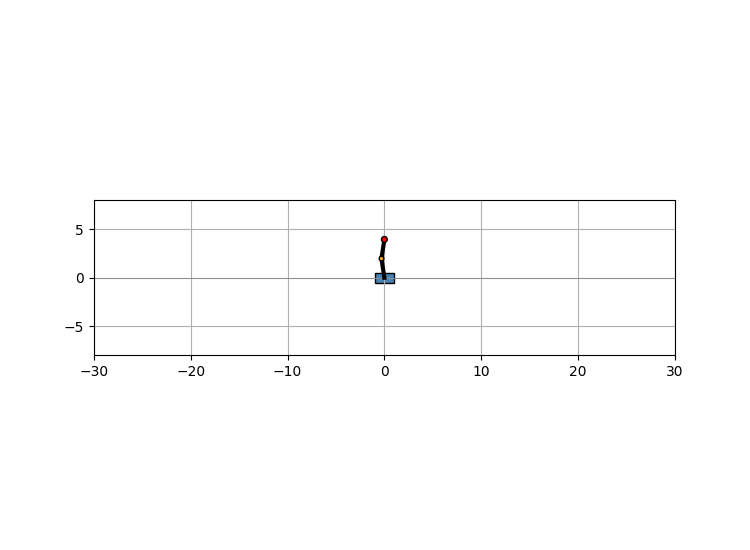

# MPC Double Cart-Pole

Nonlinear Model Predictive Control (MPC) of a cart driving a **double pendulum**,
with real-time target switching between all four equilibria (down-down, down-up,
up-down, up-up). The dynamics are `@njit`-compiled for fast rollouts and the
optimizer is warm-started, so the whole loop runs interactively.

> 카트 + 2링크 진자에 대한 비선형 MPC. 키 1~4로 네 평형점을 실시간 전환하며 안정화한다.



## What it does

- **Plant.** A cart of mass `M` on a frictionless rail carries a serial two-link
  pendulum (links `l1, l2`, point masses `m1, m2`). The only actuator is a
  horizontal force `F` on the cart (an underactuated, 1-input / 3-DOF system).
- **State.** `x = [xc, θ1, θ2, ẋc, θ̇1, θ̇2]`, with angles measured from the
  downward vertical (`θ = 0` hanging down, `θ = π` inverted).
- **Model.** The manipulator equation `M(q) q̈ = R(q, q̇, F)` is solved in closed
  form (explicit 3×3 inverse via cofactors) in `fx_numba`, then integrated with a
  fixed-step **RK4** (`rk4_step_numba`).
- **Controller.** At each tick it solves a finite-horizon optimal control problem

  ```
  min_{u_0..u_{N-1}}  Σ_{i=0}^{N-1} ( eᵢᵀ Q eᵢ + uᵢᵀ R uᵢ )  +  e_Nᵀ P_f e_N
  s.t.  x_{i+1} = RK4(x_i, u_i),   -40 ≤ u_i ≤ 40,   e = wrap(x - x_ref)
  ```

  - `wrap(·)` maps the two angle errors into `(-π, π]` so the cost sees the
    shortest rotation (this is what makes swing-up / target switching behave).
  - The **terminal cost** `P_f` is the discrete-time LQR value function: at each
    target equilibrium the discrete step is linearized by finite differences
    (`get_jacobian`) and `solve_discrete_are` gives `P_f`. This approximates the
    infinite-horizon tail beyond the `N`-step window, so a short horizon stays stable.
  - Solved with SciPy `SLSQP`, **warm-started** by shifting the previous solution
    one step (receding horizon).

## Run

```bash
pip install -r requirements.txt

# interactive (opens a window; press 1/2/3/4 to switch target)
python MPC_double_cartpole.py

# render the demo GIF headless (no window)
python record_demo.py
```

**Controls (interactive window):**

| key | target                 |
|-----|------------------------|
| `1` | down-down (rest)       |
| `2` | down-up                |
| `3` | up-down                |
| `4` | up-up (full inversion) |

First launch is slower while Numba compiles; subsequent runs use the cache.

## Files

| file                     | role                                                           |
|--------------------------|----------------------------------------------------------------|
| `Dynamics_double.py`     | equations of motion (`fx_numba`), RK4 step, matplotlib drawing |
| `MPC_double_cartpole.py` | MPC cost, terminal-cost/DARE setup, `StepSolver`, interactive loop |
| `record_demo.py`         | headless runner that saves `assets/demo.gif`                   |

## Tuning knobs

- `N`, `step_length` — horizon length and control period (in `MPC_double_cartpole.py`).
- `Q`, `R` — state / input weights.
- `phys_params = (M, m1, m2, l1, l2, g)` — plant parameters (keep consistent
  between the solver and the simulation).
- `bounds=[(-40, 40)]` and SLSQP `maxiter` / `ftol` — actuator limit and
  solve budget per tick.

## Notes / limitations

- Point-mass links, frictionless cart, no actuator dynamics or measurement noise.
- SLSQP is a local solver: from far-off states it can settle into a local optimum
  and miss a swing-up. Raise `N`, loosen bounds, or seed a better guess if needed.
- Single-shooting with a dense control sequence — fine at this size, not meant to
  scale to long horizons.

## License

MIT — see [LICENSE](LICENSE).
